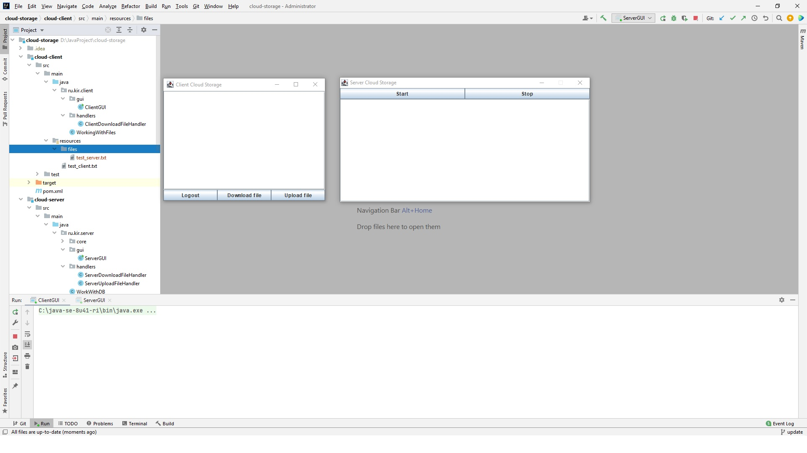
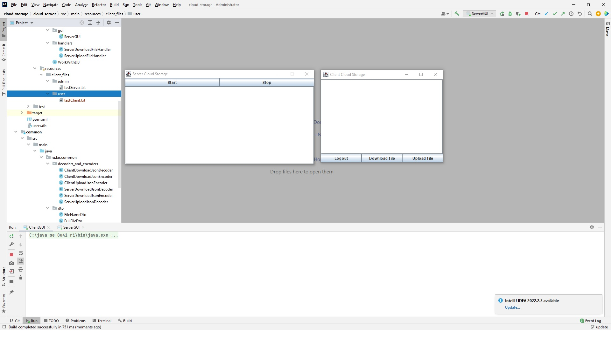

#Проект: Облачное хранилище с возможностью скачивания и загрузки файлов с использованием Netty.
___
##Функционал:
___
* Возможность скачивание файла с сервера (скачиваемый с сервера файл: testServer.txt ).

  
* Возможность загрузки файла на сервера (загружаемый на сервер файл: testClient.txt )..
